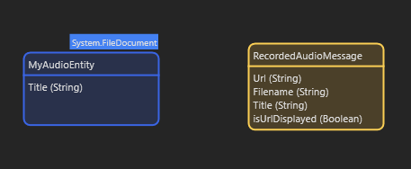
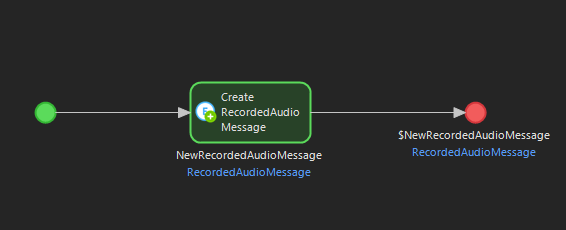
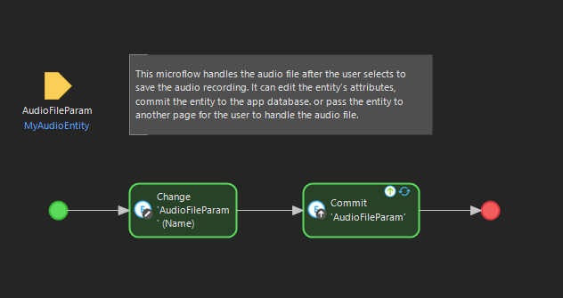
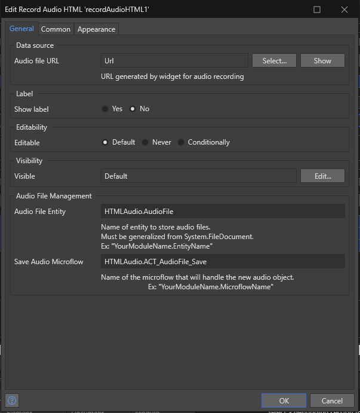

# RecordAudioHTML
[Mendix Pluggable Widget](https://docs.mendix.com/howto/extensibility/pluggable-widgets/) 
that records audio in the browser window and allows saving the audio file in a 
`System.FileDocument` in the database.

Created by Lauren Anderson, 2020

Updated by Jacob Thomsen, 2023

Created in Mendix Studio Pro version 9.18.2

## Features
- Mendix pluggable widget records audio using HTML 
[MediaRecorder](https://developer.mozilla.org/en-US/docs/Web/API/MediaRecorder) 
- Pause recording and continue
- Play recorded audio
- Download audio as a .weba file 
- Save audio in a System.FileDocument entity in Mendix

## Project setup 
1. Clone this repository
2. Navigate to the repository from the command line
3. Run `npm install` to download all the required node modules

## Modify code
Navigate to `/src` and edit files
 - `RecordAudioHTML.xml` is the widget properties menu that displays in Mendix Studio Pro.
 - `/components/RecordAudio.tsx` is where the primary rendering code for the widget is.

## Build widget
Run `npm run build` in the project root directory.

This builds the widget .mpk file in the `/dist/1.0.0` directory.

If you have a Mendix project in Studio Pro that you want the compiled widget to be copied to 
when it's built, edit `package.json` in the root and edit or add `"projectPath"` under the 
`"config"` object.

For example, to have the compiled widget copied to a Mendix Studio Project called 
`My Audio Test` (main branch), the `"config"` object in `package.json` would look like this:
 
```json
  "config": {
    "projectPath": "C:\\Users\\myuser\\Documents\\Mendix\\My Audio Test-main",
    "mendixHost": "http://localhost:8080",
    "developmentPort": 3000
  },

``` 

## Setting Up
### To add the widget to your project
1. Download this repository
2. Move the file `edu.byu.widget.web.RecordAudioHTML.mpk` from `/dist/1.0.0.` to your 
Mendix application's `widgets` folder
3. In Studio Pro, press F4 or navigate to App -> Synchronize App Directory, and click this option.

### Making the widget functional
To use the widget, there are a few items you will need complete in your project.
1. In your Domain Model, add a first entity, non-persistable, with these fields:  
Url : String,  
Filename : String,  
Title : String,   
isUrlDisplayed : Boolean (Default: false)

This entity is used to generate audio blob urls, which are how MediaRecorder stores the audio within the browser.

2. Add a persistable entity that is a generalization of System.FileDocument, with one attribute, Title : String



3. Create a Microflow, named however you please, that returns and creates an instance of the first entity.



4. On the page where you would like to have the widget, add a DataView which calls the microflow you just created. 
5. In the DataView, below the Text Box, place the widget.


6. Create a Microflow that takes an instance of the persistable entity as a paramter and then handles the entity-
which now contains the audio file- as you please.



### Widget Settings
These are the required settings of the widget you will need to set in order to use the widget.
- Set the Data source of the widget to be the Url string of the given entity.*

#### Audio File Management
- Enter the title of the Microflow you made to handle the audio file when the save recording button is selected.
- Enter the title of the persistable entity you created to store the audio file.



## User Interaction
Once you have the widget set up, it should look like this on the web page.


You can use other widgets like HTMLSnippet's to create an instructions panel for this Recording Widget.

## Issues, suggestions and feature requests
[Issues Page](https://github.com/laurenra7/RecordAudioHTML/issues)

## Development and contribution
[specify contribute]
