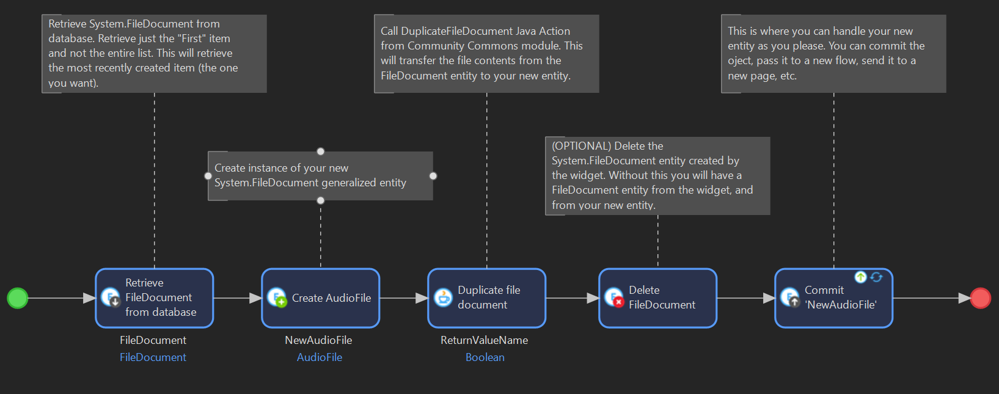

# RecordAudioHTML
[Mendix Pluggable Widget](https://docs.mendix.com/howto/extensibility/pluggable-widgets/) 
that records audio in the browser window and allows saving the audio file in a 
`System.FileDocument` in the database.

Created by Lauren Anderson, 2020

Updated by Jacob Thomsen, 2023

Created in Mendix Studio Pro version 9.18.2.
Functional in 8.18.24, but not 7.23.35.

*Community Commons Module recommended for full functionality* [Download](https://marketplace.mendix.com/link/component/170)

## Features
- Mendix pluggable widget records audio using HTML 
[MediaRecorder](https://developer.mozilla.org/en-US/docs/Web/API/MediaRecorder) 
- Pause recording and continue
- Play recorded audio
- Download audio as a .weba file 
- Save audio in a System.FileDocument entity in Mendix

## Project setup 
1. Clone this repository
2. Navigate to the repository from the command line
3. Run `npm install` to download all the required node modules

## Modify code
Navigate to `/src` and edit files
 - `RecordAudioHTML.xml` is the widget properties menu that displays in Mendix Studio Pro.
 - `/components/RecordAudio.tsx` is where the primary rendering code for the widget is.

## Build widget
Run `npm run build` in the project root directory.

This builds the widget .mpk file in the `/dist/1.0.0` directory.

If you have a Mendix project in Studio Pro that you want the compiled widget to be copied to 
when it's built, edit `package.json` in the root and edit or add `"projectPath"` under the 
`"config"` object.

For example, to have the compiled widget copied to a Mendix Studio Project called 
`My Audio Test` (main branch), the `"config"` object in `package.json` would look like this:
 
```json
  "config": {
    "projectPath": "C:\\Users\\myuser\\Documents\\Mendix\\My Audio Test-main",
    "mendixHost": "http://localhost:8080",
    "developmentPort": 3000
  },

``` 

## Setting Up
### To add the widget to your project
1. Download this repository
2. Move the file `edu.byu.widget.web.RecordAudioHTML.mpk` from `/dist/1.0.0.` to your 
Mendix application's `widgets` folder
3. In Studio Pro, press F4 or navigate to App -> Synchronize App Directory, and click this option.

## Using the Widget


Once the widget is in your project and available to be used. Just place the widget on to your page of choice. 
It can now record audio and save it as a System.FileDocument entity in your app database!

### Customizing How The New Audio Is Handled

With this widget, you can do more than just save the audio as a new System.FileDocument entity.

To save the audio into an entity within your own domain model, change the Handler Action in the widget configuration
to Microflow, Nanoflow, or Show A Page. Other options in this dropdown may be selected, but functionality of the widget
is not guaranteed.


Here is an example of a microflow that can be used to handle the FileDocument and use it to create an entity in your
app domain model.



To copy the System.FileDocument using the Java Action in this microflow, you will need to import the Community Commons
module into your application. 

## User Interaction
Once you have the widget set up, it should look like this on the web page.


You can use other widgets like HTMLSnippet's to create an instructions panel for this Recording Widget.

## Issues, suggestions, and feature requests
[Issues Page](https://github.com/laurenra7/RecordAudioHTML/issues)
